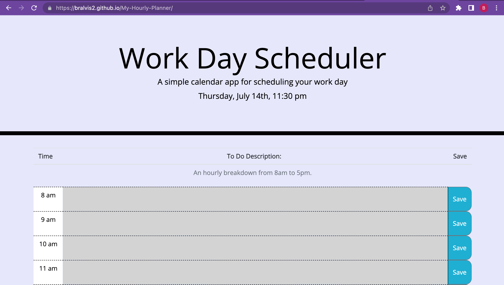
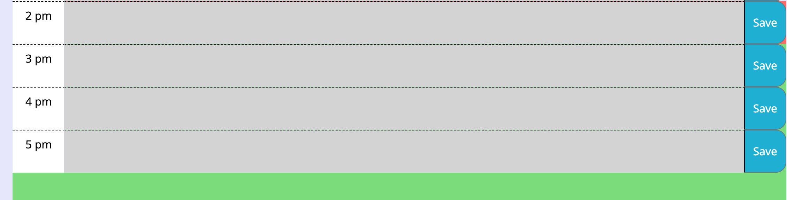
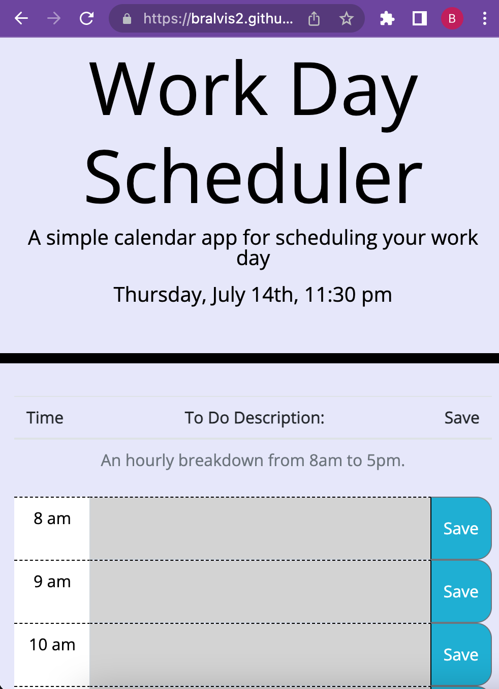
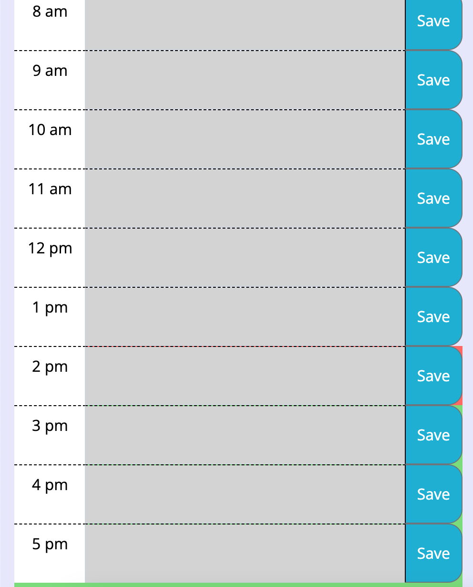

# My-Hourly-Planner
 ## Description
 The perfect planner to increase productivity. This application is designed with the purpose of keeping track of your productivity throughout the work day. Each hour of your work day is broken down by the hour. It allows you to save your schedule so that you can go back to it throughout the day and add to the planner. It is user friendly with a simple concept. 
 ## How To
 Deployed Application: https://bralvis2.github.io/My-Hourly-Planner/

 To use this application, click on the link provided above. At the top of the page, you will see today's date and time. Use the mouse to click in they grey text box. Once the curser is in the box, the user can begin typing in their todo's. Then click on the save button to save the description. The current hour you are on will be highlighted in red. Hours that have not yet passed will be highlighted in green. Time that has passed will be light grey. 

 ## Bugs 🐛
 I had some trouble targeting the textarea. I managed to get the the color to change with time. However, the whole row changed instead of just the text area. I would really appreciate some feedback on that particular aspect. 

 ## Credits & Resources
 I'd like to give thanks to our TA Diem for her help. I used many examples from the UT resources provided in class. As well as W3Schools and MDN. 
